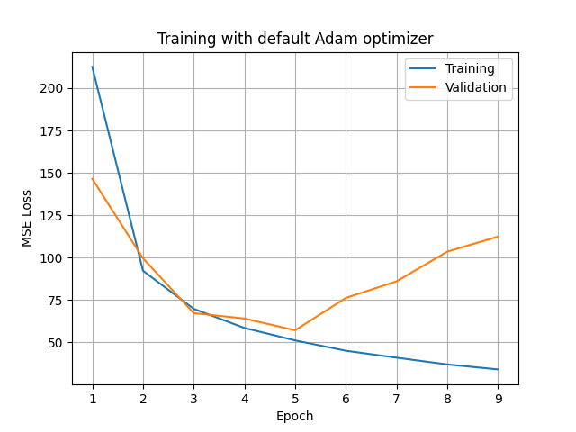

# Training a network for homography prediction

Here we used a synthetically generated dataset of ... to train a homograpghy prediction network. We evaluate MACE results achieved HomographyNet (as seen in
https://arxiv.org/pdf/1606.03798.pdf)

## Background
TODO

## Setup
1. Create a virtual environment and install the required dependencies as
follows:
```bash
# Clone this repo
cd homography-dl
python3 -m venv venv
source venv/bin/activate
pip3 install --upgrade pip
pip3 install -r requirements.txt
```

2. Download training and test data to your local filesystem from:
https://drive.google.com/drive/folders/1ikm8MuB34-38xNS5v1dzZOBUJLXUV4ch

Now test that you can the complete training and testing loop on a toy amount of
data:
```bash
python3 run.py \
        --test-data=<path_to/test.h5> \
        --train-data=<path_to/train.h5> \
        --mini=True
```

## Running on a GPU remotely
Note: this can be run on a GPU by using colab.research.google.com as follows:
1. Select `Edit > Notebook settings > Hardware accelerator > GPU`.
2. In a code cell, clone this repo and `cd` into the directory:
```
!git clone <repo url>
!cd homography-dl
```
3. Log into Google drive, and locate the above data directory in your 'Shared
with me' folder. Add a shortcut to your 'My Drive' folder.
4. Add a code cell to mount this folder, and copy it locally:
```
from google.colab import drive
drive.mount('/content/drive')
!mkdir /content/data
!cp /content/drive/MyDrive/homography/test.h5 /content/data/
!cp /content/drive/MyDrive/homography/train.h5 /content/data/
!ls /content/data/
```
5. Now you can execute `python3 run.py` to train on a GPU via the
`--device=cuda` option. Test to see this is working by adding a code cell with:
```bash
!python3 run.py \
         --test-data=/content/data/test.h5 \
         --train-data=/content/data/train.h5 \
         --device=cuda \
         --mini=True
```
## Model architechture and design decisions


## Results
The following command was can be used to train and test the network on a
machine with a GPU.
```bash
python3 run.py \
        --test-data=<path_to/test.h5> \
        --train-data=<path_to/train.h5> \
        --device=cuda \
        --batch-size=64 \
        --epochs=9
```
Training with a batch size of 64 is the largest power-of-2 batch size that can
fit on the single GPU used (Tesla K80, 24GB, according to
`torch.cuda.get_device_name(0)`). This gave a throughput of slightly over 160
images per second while training, resulting in around 10 minutes per epoch.

This above comnand trains the network for 9 epochs, generating the validation
MSE loss curve below TODO.
As you can see, the model converges after 5 epochs. The model state after the
5th epoch is loaded, and the MACE is calculated on the test set. A final MACE
of 8.81 is achieved.

This is similar to - in fact slightly better than - that reported in the
HomographyNet paper (9.20).



## Limitations, improvements and further work
The HomographyNet paper (June, 2016) is now nearly 6 years old, which is a long time in the CV/ML world. We can see here https://paperswithcode.com/sota/homography-estimation-on-pds-coco that HomographyNet was surpassed as the SOTA architechture for homography estimation in 2019 by PFNet (and again with a more recent iteration). I'd be interested to reimplement this model in PyTorch. `run.py` could be easily extended to support more models via a command-line argument. Note that paperswithcode.com reports HomographyNet as achieving a MACE of 2.5. Not sure why this is. PFNet is a much deeper network (more FLOPs per iteration) than HomographyNet, but has a similar number of parameters. >90% of HomographyNet's parameters are in its penultimate FC layer.


### TODO
- design decisions: optimizer, lr schedule, train-test split, batch size
- Choice of loss: MSE.
    - The MSE loss is very similar metric to MACE, but slightly less computationally expensive
- Using MSE loss, and optimizer as specified in the paper (SGD, lr=0.005, momentum=0.9), I saw exploding gradients, which quickly led to a NaN loss.
- Switching to default Adam optimizer (as is generally regarded as a safe first guess) solved this, producing the MSE loss curve below:
- The loss values reported here https://github.com/mazenmel/Deep-homography-estimation-Pytorch/blob/master/DeepHomographyEstimation.ipynb do not match up with those seen in my implementation, as the input data is transformed in the paper:
    - labels input images are scaled to be in the range [-1, 1]
- I haven't followed this approach, as it would result in a different MACE

- Follow-up work:
    - understand (by means of visualization) how learned features of first layer differ for homography estimation networks vs image classifiers (as firs conv layer for imagenet ResNet, for example, learns filters for RGB layers, whereas homography estimators trained on COCO learn filters for 2 separate grayscale perspective projections)

- Comment on the limitations of how well this would generalize to a real-world test set, vs 
    - A homography only relates two projections in the scenarios:
        - Rotation only movements
        - Planar scenes
        - Scenes in which objects are very far from the viewer
    - In the generated dataset we are using, none of these assumptions are guaranteed to hold. So a model trained on this data may lead to bad generalization on real world test data.
    - Traditional CV homography estimation teqniques (e.g. SIFT + RANSAC) do not suffer from this problem, as they do not require large synthetic data sets to train.

- An example taken from the test set is this crop of an image of a dog, beside the transformed image:


