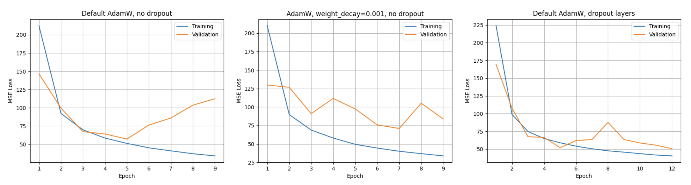
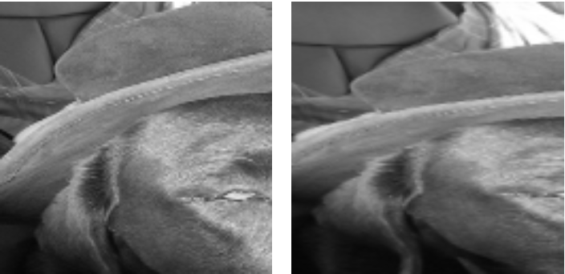

# Training a network for homography prediction

A homography is a transformation relating two projections of a planar surface.
It is a 3x3 matrix, that maps an image coordinates of a point on a plane to
coordinates in another image. Since we are using homogeneous corrdinates, its
scale doesn't matter, so a solutions requires finding (at least) four matching
points, to give eight equations for the eight unknowns. The homography can then
be solved for using linear least squares.

Traditional CV methods for doing this involve key point detection (e.g. SIFT)
followed by correspondence matching (e.g. min distance + RANSAC).

Here we try to replace these steps by training a DNN. We use the model
HomographyNet (described in https://arxiv.org/pdf/1606.03798.pdf) as the
starting point with which to experiment.

To train our network we have a synthetic COCO-based dataset described as
follows:
- The two channels of the input represent two projections of the same planar
  scene from different viewpoints, in grayscale.
- The target is a vector containing offsets of four corners of a random crop of
  the first channel, giving their positions in the second channel. The four
  corner offsets can be used to generate the eight equations to solve the
  homography, and can thus be said to encode the homography.

## Setup
1. Create a virtual environment and install the required dependencies as
follows:
```bash
# Clone this repo
cd homography-dl
python3 -m venv venv
source venv/bin/activate
pip3 install --upgrade pip
pip3 install -r requirements.txt
```

2. Download training and test data to your local filesystem from:
https://drive.google.com/drive/folders/1ikm8MuB34-38xNS5v1dzZOBUJLXUV4ch

Now test that you can the complete training and testing loop on a toy amount of
data:
```bash
python3 run.py \
        --test-data=<path_to/test.h5> \
        --train-data=<path_to/train.h5> \
        --mini=True
```

## Running on a GPU remotely
Note: this can be run on a GPU by using
[colab.research.google.com](colab.research.google.com) as follows:
1. Select `Edit > Notebook settings > Hardware accelerator > GPU`.
2. In a code cell, write `run.py` to remote disk:
```
%%writefile run.py
# paste run.py here
```
3. Log into Google drive, and locate the above data directory in your 'Shared
with me' folder. Add a shortcut to your 'My Drive' folder.
4. Add a code cell to mount this folder, and copy it locally:
```
from google.colab import drive
drive.mount('/content/drive')
!mkdir /content/data
!cp /content/drive/MyDrive/homography/test.h5 /content/data/
!cp /content/drive/MyDrive/homography/train.h5 /content/data/
!ls /content/data/
```
5. Now you can execute `python3 run.py` to train on a GPU via the
`--device=cuda` option. Test to see this is working by adding a code cell with:
```bash
!python3 run.py \
         --test-data=/content/data/test.h5 \
         --train-data=/content/data/train.h5 \
         --device=cuda \
         --mini=True
```

## Model architechture and design decisions
HomographyNet uses a VGG-like Network with eight convolutional layers (the CNN
backbone that does the key point detection work of SIFT) and two fully connected
layers (which predict the corner offsets). The key points of this archtecture
are:
- Conv layers and Relu non-linearity as the basic feature detection block.
- Pooling layers, so convolutions layers detect features over a range of scales
  (with more complex features further down the network, so more channels per
  layer).
- Batch normalization to reduce the change in distribution of activations passed
  to the subsequent convolution layer between iterations. The result of this is
  to improve training stability for a given learning rate.
- Dropout after the fully connected layers for regularization (not the
  convolutional layers, as (1) they contain far fewer parameters, so require
  less regularization, and (2) have less of a regularizing effect anyway when
  applied to highly correlated signals like images/feature maps which are fed
  into subsequent convolutional layers).
See `class Model` in `run.py` for the Pytorch implementation.

For the training (and interleaved validation) phase, we use mean squared error
(MSE) loss. This is essentially the same metric as mean average corner error
(MACE), which we use for evaluating the trained model, but less computationally
expensive.

For the optimizer, I achieved the best result using AdamW with default Pytorch
hyperparameters. In the results section I describe the how this performs in
terms of overfitting. Note that using the optimizer described in the
HomographyNet paper (SGD with lr=0.005, momentum=0.9) I saw exploding gradients.
Adaptive optimizers (like AdamW) are tolerant to a range of learning rates
relative to standard SGD with momentum, so are a good 'first try' given the
limited time I was willing to spend tuning hyperparameters.

It's common practice to normalize the input data to zero mean and unit variance
(idependently for each channel) as part of a data preparation. This is to
prevent the scale of a channel from influincing the its predictive behaviour,
especially at the start of training. However, from my experiments of training
with/without normalization for this model, it does not improve the accuracy (and
was actually worse when running with `--normalize=True` over nine epochs). With
more time I would investigate this further, but I suspect it may be because the
two input hannels are very correlated (i.e. already have the same mean and
variance) due to how the data is generated. Normalization of input data is
disabled by default.

## Results
The following command was used to train and test the network on a machine with
a GPU.
```bash
python3 run.py \
        --test-data=<path_to/test.h5> \
        --train-data=<path_to/train.h5> \
        --device=cuda \
        --batch-size=64 \
        --epochs=12

Training and validation phase:
Epoch 1/12
    Training:: 100%|█████████████████| 1479/1479 [09:31<00:00,  2.59it/s]
    Testing:: 100%|████████████████████| 370/370 [00:41<00:00,  8.83it/s]
    Mean train loss: 224.1041259765625
    Mean validation loss: 169.4061737060547
Epoch 2/12
    Training:: 100%|█████████████████| 1479/1479 [09:33<00:00,  2.58it/s]
    Testing:: 100%|████████████████████| 370/370 [00:41<00:00,  8.82it/s]
    Mean train loss: 98.82392883300781
    Mean validation loss: 107.5336685180664
Epoch 3/12
    Training:: 100%|█████████████████| 1479/1479 [09:33<00:00,  2.58it/s]
    Testing:: 100%|████████████████████| 370/370 [00:41<00:00,  8.83it/s]
    Mean train loss: 74.7654800415039
    Mean validation loss: 67.44741821289062
Epoch 4/12
    Training:: 100%|█████████████████| 1479/1479 [09:33<00:00,  2.58it/s]
    Testing:: 100%|████████████████████| 370/370 [00:41<00:00,  8.84it/s]
    Mean train loss: 64.91635131835938
    Mean validation loss: 66.55428314208984
Epoch 5/12
    Training:: 100%|█████████████████| 1479/1479 [09:33<00:00,  2.58it/s]
    Testing:: 100%|████████████████████| 370/370 [00:41<00:00,  8.83it/s]
    Mean train loss: 58.941009521484375
    Mean validation loss: 52.0803337097168
Epoch 6/12
    Training:: 100%|█████████████████| 1479/1479 [09:33<00:00,  2.58it/s]
    Testing:: 100%|████████████████████| 370/370 [00:41<00:00,  8.84it/s]
    Mean train loss: 54.21776580810547
    Mean validation loss: 62.04312515258789
Epoch 7/12
    Training:: 100%|█████████████████| 1479/1479 [09:33<00:00,  2.58it/s]
    Testing:: 100%|████████████████████| 370/370 [00:41<00:00,  8.85it/s]
    Mean train loss: 50.453529357910156
    Mean validation loss: 63.52751541137695
Epoch 8/12
    Training:: 100%|█████████████████| 1479/1479 [09:31<00:00,  2.59it/s]
    Testing:: 100%|████████████████████| 370/370 [00:41<00:00,  8.85it/s]
    Mean train loss: 47.610870361328125
    Mean validation loss: 87.72610473632812
Epoch 9/12
    Training:: 100%|█████████████████| 1479/1479 [09:32<00:00,  2.59it/s]
    Testing:: 100%|████████████████████| 370/370 [00:41<00:00,  8.85it/s]
    Mean train loss: 45.70289611816406
    Mean validation loss: 63.50666427612305
Epoch 10/12
    Training:: 100%|█████████████████| 1479/1479 [09:32<00:00,  2.58it/s]
    Testing:: 100%|████████████████████| 370/370 [00:41<00:00,  8.85it/s]
    Mean train loss: 43.61228561401367
    Mean validation loss: 58.66664505004883
Epoch 11/12
    Training:: 100%|█████████████████| 1479/1479 [09:32<00:00,  2.58it/s]
    Testing:: 100%|████████████████████| 370/370 [00:41<00:00,  8.85it/s]
    Mean train loss: 41.63165283203125
    Mean validation loss: 55.50944519042969
Epoch 12/12
    Training:: 100%|█████████████████| 1479/1479 [09:32<00:00,  2.58it/s]
    Testing:: 100%|████████████████████| 370/370 [00:41<00:00,  8.84it/s]
    Mean train loss: 40.453086853027344
    Mean validation loss: 50.618919372558594
Saving model params with best validation loss: 50.618919372558594
Final evalutaion on test data:
    Testing:: 100%|██████████████████████| 79/79 [00:08<00:00,  8.86it/s]
Final mean MACE: 8.138694763183594
```
Training with a batch size of 64 is the largest power-of-2 batch size that can
fit on the single GPU used (Tesla K80, 11.4GB, according to
`torch.cuda.get_device_properties(0)`). This gave a throughput of slightly over
160 images per second while training, resulting in around 10 minutes per epoch.

This above comnand trains the network for 12 epochs, generating the right of the
three loss curves below.



The model state that gave the best validation loss (in this case the final
state) is loaded, and the MACE is calculated on the test set. **A final MACE
of 8.14 is achieved** with the above command.

This is similar to - in fact slightly better than - that reported in the
HomographyNet paper (9.20).

If I had more time I would have trained for many more epochs in this
configuration.

The other two graphs show training performance for two configurations when
running with `--dropout=False`. The first demonstrates the overfitting you
get without the regularization that you get from dropout. In theory, L2
regularization via weight decay should also prevent the fitting. However, the
middle figure shows how a weight decay of 0.001 with AdamW performs poorly in
comparison to dropout.

## Limitations, improvements and further work

1. Something I'm sceptical of (and not commented on in the HomographyNet paper)
is the ability for a model trained on a synthetic data set generated in this
way to generalize well on real world data. This is because a homography only
relates two projections in the scenarios of:
 - Rotation only movements
 - Planar scenes
 - Scenes in which objects are very far from the viewer.
 But in our synthetic dataset, none of these assumptions are guaranteed to
 hold. The below image pairs taken from the test set are an example when the
 assumptions are broken.



 I think it would be worth investigating whether the relationships between the
 two input channel of the training data set would still apply when testing on
 real world image pairs.

 Note that Traditional CV homography estimation techniques (e.g. SIFT + RANSAC)
 do not suffer from this problem, as they do not require large synthetic data
 sets to train.

2. The HomographyNet paper (June, 2016) is now nearly 6 years old, which is a
  long time in the CV/ML world. We can see
  [here](https://paperswithcode.com/sota/homography-estimation-on-pds-coco) that
  HomographyNet was surpassed as the SOTA architechture for homography
  estimation in 2019 by PFNet (and again with a more recent iteration). With
  more time, I'd like to reimplement this model in Pytorch. `run.py` could be
  easily extended to support more models via a command-line argument.
  (Note that paperswithcode.com reports HomographyNet as achieving a MACE of
  2.50. I'm not sure why this is, as it doesn't agree with what is reported in
  the paper).

  PFNet is a much deeper network more FLOPs per iteration) than HomographyNet,
  but has a similar number of parameters (as >90% of HomographyNet's parameters
  are in its penultimate FC layer) so we can expect a similar number of epochs,
  but greater time to train the network.
